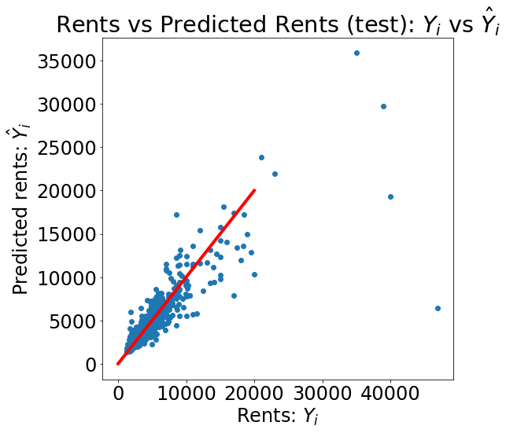
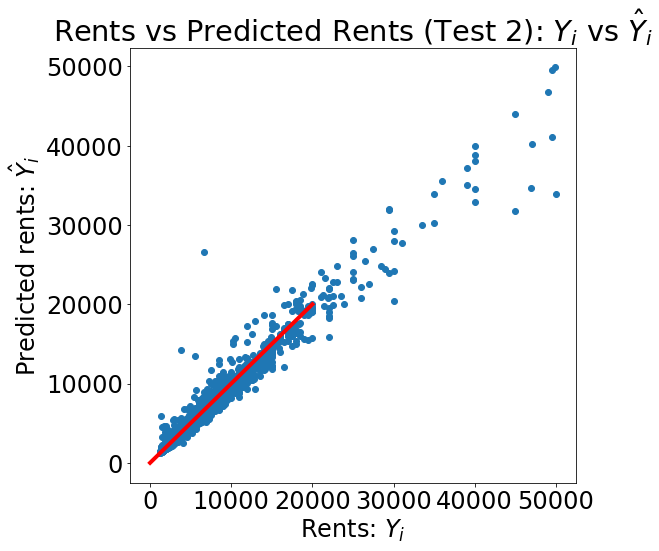

## Summary of Outcomes 

(1) Data Usage.

Apart from the original dataset, we included data from the health inspection data and average income. We added the health inspection data by counting the number of cafes that are located within 1km of a rental premise. It was our expectation that the more cafes and points of interest close to the rental property, the more the rental price would be. It is expected that people would pay more in rent to be located to points of interest for convenience and locality. The average incomes per zip code was added as a feature as it was anticipated that the greater the average income of the zip code, the greater the rental price. It may be considered an ethical consideration that the assumption that only wealthy people live within a particular zip code, whereas those not as wealthy will live in zip codes where the average is lower. 

(2) Data Exploration.

The outliers that were of concern were those in the features used within our model. There were outliers within the size sqft, bathrooms and bedrooms. For the larger outliers in the size sqft there were 3 data points that seemed incorrect, and this was evident by the rental price, the number of bathrooms and bedrooms per size sqft. It was decided that these were an error and it appeared a data entry of an extra 0, so these were reduced by a factor of 10. Another large outlier was the number of bathrooms. There were also 3 data points that did not make sense on inspection and these were adjusted to match the number of bathrooms listed in the description. 
 
 In regards to missing values, those missing values were filled by the mean value. The reason why they pose a challenge is because those values are not accurate. We are assuming and predicting a value, which does not make all our data accurate. We examined both imputing missing values with the median and mean, our analysis did not show a significant difference and because there were no significant outliers in the missing data we ended up using the mean. Some aspects of the data that might be problematic is the rental data is not normalized, data performance is better if the target data is normalized. 

(3) Transformation and Modeling.

Five features that played the biggest role were: 

 - size_sqft. Importance: 0.58
 - Distance to TimesSquare. Importance: 0.09
 - Number of bathrooms. Importance: 0.08
 - Number of cafes within 1km. Importance: 0.07
 - Total Average Income Amount. Importance: 0.06
 
The size_sqft and bathrooms features were included in the original dataset. It was expected that these would have importance in the model as the rental price would depend upon the size of the apartment and correlating somewhat with this is the number of bathrooms. The distance to Times Square was created using the latitude and longitude data, it was predicted that the closer the apartment was to Times Square the greater the rental price. The estimated coefficient showed that rental prices decrease approximately $105/km the further away the location is from Times Square. The number of cafes was another feature created from the NYC Health Restaurant Inspection Data from Data Dive 3. It was anticipated that rental prices would increase as the number of points of interest within the area increased. People generally want to live near schools, parks and cafes(New Yorkers run on coffee and there are numerous Starbucks). The rental price increased approximately $1.77 for each cafe within 1km of the listing. The other feature was the total average income amount of the zip code taken from the IRS tax data. It was predicted that the more the zip code earnt, the higher in general the rental prices. This feature was not really as important as expected, and this we believe to be from the fact that you can have various different rental types and prices within the same zip code. This may of played more importance if we were predicting housing prices. One feature we added that didn't end up changing the performance of the model was the land value. Again, this is because majority of rentals are apartments and pricing of them are based more on floor level and view than the value of the land.     

The rental price prediction model was implemented using the Random Forest model. This model was chosen as it is simple and requires very little hyper tuning of parameters to achieve good results. With the Random Forest Algorithm, it will handle the missing values and maintain the accuracy of most our data. 

(4) Metrics, Validation, and Evaluation.

We believe our model will perform reasonably on the hold out set, provided it is a general selection of rental data like the training set. We project this based on the MSE, the R2_score of 0.76 and accuracy of 90%. Our Mean Square Error improved from Part 1. We made more gains in model performance in data cleaning and preprocessing than we did by adding more features. 

Our model is useful in predicting the rental prices within NYC. Our model does not perform that well on the more expensive apartments. This is because the small percent error at $2,500 becomes significant at $50,000. For example, the most expensive rent in the test set had a rent of $46,917 but our model only predicted $6,255 which is $40,000 off. However, there will always be outliers in our data that will be hard to predict and if we focus on these and trying to train for all data points then we risk overfitting the model.  The figure below shows the outcomes of our model predictions using Test 1 and predictions for Test after combining data. 

The figure shows the test rent predictions against actual rent. The points are closely regressed to the red diagonal line which corresponds with a smaller MSE. The graph also shows, as discussed, that where the rents are higher it does not fit this line that well. This graph also corresponds with our R square of 0.76. Lower the R Square, the weaker the fit of the model and the more disperse the points on the graph.

(5) Conclusion

In conclusion, this model could be used to reasonably predict rental prices for apartments for rent in a particular month. In NYC you would expect some seasonal variability. In summer there are interns and more tourism and apartments would have less vacancy and higher demand for rooms so prices may be a little higher. Whereas in the winter months, where we would expect them to be cheaper than the summer months. This model only used data for a particular timeframe. However, if we had a rental property in NYC we could use this model to estimate how much we could expect to list it for. If we wanted to rent an apartment in the future for a new listing we could get an idea whether the price shown was reasonable, inline with our projections or not.  

Additional modeling features I would add would include a condition value of the apartment and if the apartment had a view, apartments with views of the Empire State Building I would think would be more popular. Another feature would also be a time of how long the apartment has been listed with the idea that an overpriced or undesirable apartment would be listed for longer periods.

We would rather have more data than features. However, in saying that the data would need to be clean and reliable. Our projection model results are dependent upon the reliability and correctness of the data. Within the test set there were a few abnormalities within the data that would affect the model performance. We tried to reduce the impact of these as much as possible however they still exist within a large dataset. Additional features would require more data. We added additional features however, this did not add much value to the model results. Additional data would help, however the more ideal scenario would be cleaner data that had less errors. With rental prices, there will always be listings that are underpriced and overpriced but with more data the abnormalities will be normalized. 
